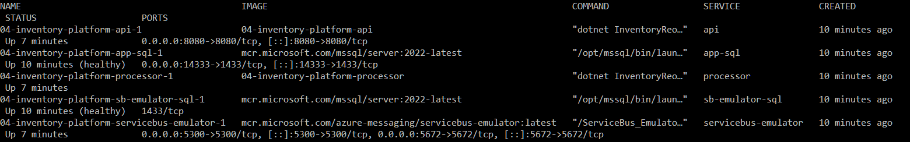
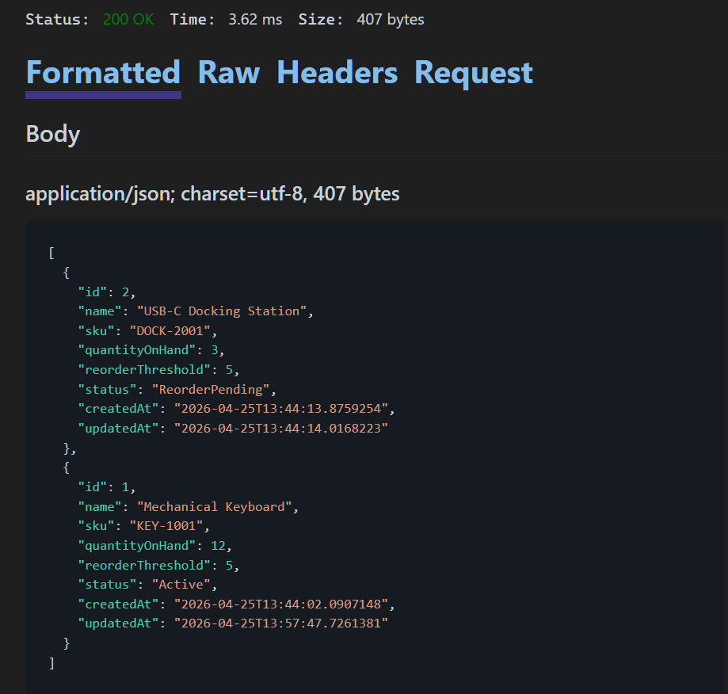
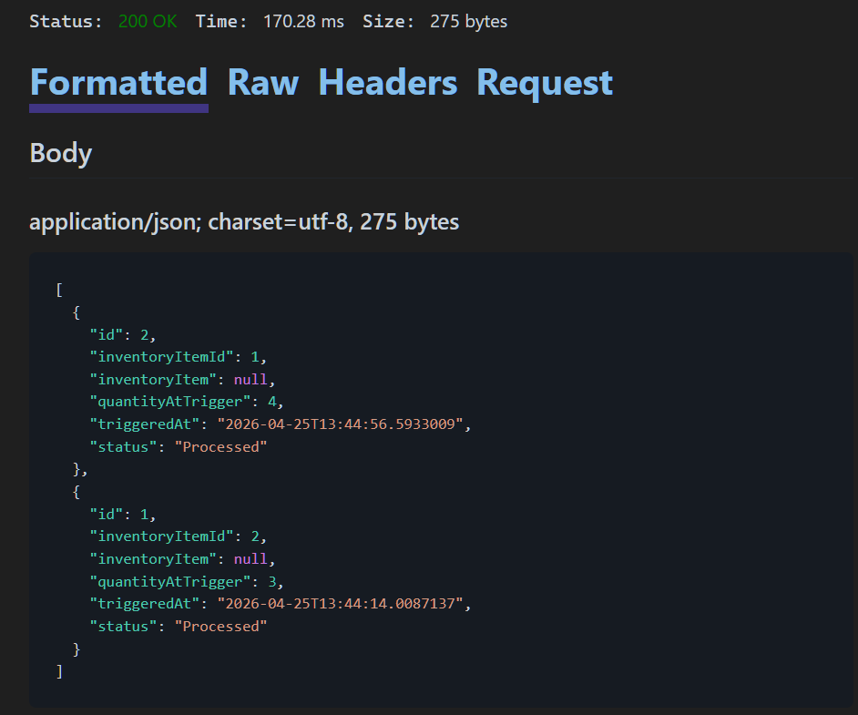
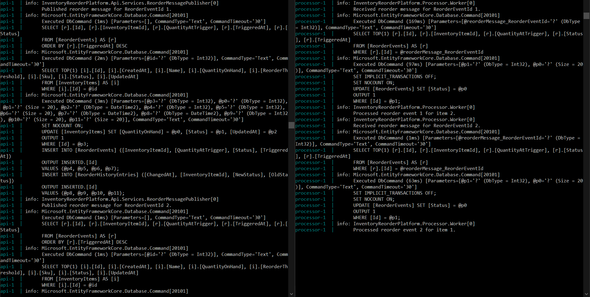

# Event-Driven Inventory Reorder Platform

A .NET portfolio project focused on event-driven workflow, background processing, relational data modeling, containerized local development, and cloud-ready application architecture.

## Purpose

This project was built to strengthen my backend portfolio with a .NET solution that goes beyond basic CRUD and server-rendered business forms.

The goal was to demonstrate practical experience with:
- ASP.NET Core Web API development
- background processing with a Worker Service
- event-driven workflow design
- Entity Framework Core and SQL Server
- distributed application structure with .NET Aspire
- containerized local development with Docker
- Azure-compatible messaging concepts using the Azure Service Bus Emulator
- zero-cost local infrastructure for development and testing

## Project Concept

The application models a lightweight internal inventory platform.

Inventory items have stock levels and reorder thresholds. When stock falls below the configured threshold, the API changes the item to `ReorderPending`, creates a reorder event, and publishes a reorder message. A separate Processor consumes that message and marks the reorder event as `Processed`, representing that the reorder request has been handled by the background workflow.

A processed reorder event does **not** mean that replacement stock has already arrived. The Processor does not automatically increase `QuantityOnHand`, and the inventory item correctly remains `ReorderPending` while its quantity is still at or below the reorder threshold. A later inventory update can represent receipt of new stock; when the quantity rises above the threshold, the item returns to `Active`.

The project is intentionally scoped like a small internal business platform rather than a polished product or commercial SaaS application. It models the internal reorder-request lifecycle without claiming a real purchasing integration or external vendor fulfillment process.

## What This Project Demonstrates

This project is intended to show that I can build more than simple request/response CRUD applications.

It demonstrates:
- API-first backend design
- background worker processing
- message-driven workflow
- separation between inventory state and reorder-event state
- shared data and contracts across projects
- SQL-backed business state
- container-aware local development
- cloud-ready architectural thinking without requiring paid cloud deployment

## Tech Stack

- C#
- ASP.NET Core Web API
- Worker Service
- .NET Aspire
- Entity Framework Core
- SQL Server
- Docker
- Docker Compose
- Azure Service Bus client libraries
- Azure Service Bus Emulator
- React
- TypeScript
- Vite

## Solution Structure

The solution is organized as a small multi-project distributed application.

### `InventoryReorderPlatform.AppHost`
Orchestrates the API, Processor, and application SQL Server locally during development with Aspire. In Aspire mode, the Service Bus Emulator and its SQL dependency are started separately through Docker Compose before the AppHost is launched.

### `InventoryReorderPlatform.ServiceDefaults`
Holds shared service defaults for the distributed application.

### `InventoryReorderPlatform.Api`
Provides the main application surface for inventory item management, reorder visibility, and reorder-message publishing.

### `InventoryReorderPlatform.Processor`
Consumes reorder messages and updates reorder-event processing state. Processing a message records that the reorder request was handled; it does not automatically replenish inventory.

### `InventoryReorderPlatform.Data`
Holds the shared EF Core data layer, including:
- entity models
- `AppDbContext`

### `InventoryReorderPlatform.Contracts`
Holds shared cross-project contracts, including:
- messaging contracts
- shared configuration classes

### `client`
Contains the React/TypeScript operations dashboard used for inventory visibility, summary metrics, and low-stock filtering.

## Current Features

- Distributed .NET solution structure using Aspire
- Shared EF Core data layer used by both API and Processor
- Shared contracts layer for messaging and configuration
- SQL-backed persistence with Entity Framework Core
- Relational data model for:
  - inventory items
  - reorder events
  - reorder history
- Inventory API endpoints for:
  - get all inventory items
  - get inventory item by id
  - create inventory item
  - update inventory item
- Reorder event API endpoint for:
  - get all reorder events
- DTO-based request and response flow for the API
- Automatic inventory status calculation based on quantity on hand and reorder threshold
- Automatic inventory status transitions to:
  - `Active`
  - `ReorderPending`
- Automatic reorder event creation when an item transitions into `ReorderPending`
- Automatic reorder history creation when an inventory item status changes
- Duplicate reorder event avoidance when an item remains in the same low-stock state
- Reorder event processing states:
  - `Pending` — the reorder request is waiting to be handled by the Processor
  - `Processed` — the Processor handled the request and completed the message
- Queue-based reorder message publishing from the API
- Queue-based reorder message consumption in the Processor
- End-to-end producer/consumer workflow running locally
- Inventory items remain `ReorderPending` until their quantity is updated above the reorder threshold
- Container-friendly SQL Server development path through Aspire-managed infrastructure
- Docker support for the API and Processor
- Root-level Docker Compose local stack for:
  - application SQL Server
  - Service Bus emulator
  - Service Bus emulator SQL dependency
  - API
  - Processor
- React/TypeScript inventory operations dashboard with:
  - inventory list view
  - summary cards
  - low-stock filtering
  - loading and error states
- Zero-cost Azure-compatible messaging development using the official Azure Service Bus Emulator

## Expansion

This repository is being expanded through a second portfolio phase: **Inventory Operations and Reliability Expansion**.

The expansion focuses on production-readiness concerns around operator visibility, role-based authorization, reliable message processing, observability, and operational documentation.

The expansion now includes an initial React/TypeScript operations dashboard. Planned additions include idempotent message-processing safeguards, authorization and audit workflows, structured logging, health and readiness checks, and production-oriented tests.

See:

- `docs/inventory-operations-roadmap.md`
- `docs/inventory-operations-case-study.md`

Implemented for the Inventory Operations and Reliability Expansion so far:

- expansion roadmap
- operational case-study document
- React/TypeScript dashboard scaffold
- inventory dashboard list view
- low-stock frontend filtering
- inventory summary cards
- reorder workflow dashboard view

Planned next:

- processing history view
- system health view
- role-based authorization
- audit trail
- idempotent message-processing safeguards
- observability improvements
- reliability-focused tests
- unified frontend API endpoint configuration for Aspire and Docker run modes

### Running the Operations Dashboard

The operations dashboard is currently configured for Docker/local-stack mode, where the API is exposed at `http://localhost:8080`. After starting the full Docker stack, run the frontend from the `client` folder:

```bash
npm install
npm run dev
```

The Vite development server uses the configured `/api` proxy to reach the Docker-hosted ASP.NET Core API. Aspire-mode dashboard support is planned but not yet implemented; the frontend API target will be unified in a later expansion step so the same client configuration can work with both local run modes.

## Core Workflow

1. Inventory items are created and tracked.
2. Each item has a quantity on hand and a reorder threshold.
3. When quantity on hand becomes less than or equal to the threshold, the item transitions to `ReorderPending`.
4. A reorder event is created with `Status = "Pending"`.
5. The API publishes a `ReorderRequestedMessage`.
6. The Processor consumes that message from the queue.
7. The Processor marks the matching reorder event as `Processed` and completes the Service Bus message.
8. `Processed` means that the background reorder-request workflow handled the request; it does not mean that stock has already been received.
9. The inventory item remains `ReorderPending` for as long as its quantity remains at or below its reorder threshold.
10. A later inventory update can represent newly received stock. When quantity rises above the threshold, the item transitions back to `Active` and the status change is added to reorder history.

This separation keeps two related but distinct states accurate:

- **Inventory state:** whether current stock is healthy or requires reordering
- **Reorder-event state:** whether the background reorder request is still pending or has been processed

## Data Model

### InventoryItem
- `Id`
- `Name`
- `Sku`
- `QuantityOnHand`
- `ReorderThreshold`
- `Status`
- `CreatedAt`
- `UpdatedAt`

### ReorderEvent
- `Id`
- `InventoryItemId`
- `QuantityAtTrigger`
- `TriggeredAt`
- `Status`

### ReorderHistory
- `Id`
- `InventoryItemId`
- `OldStatus`
- `NewStatus`
- `ChangedAt`

## Screenshots






## Running the Project Locally

This project supports two local run modes.

### Aspire Mode

Best for normal development and debugging.

Aspire orchestrates the application SQL Server, API, and Processor. The Azure Service Bus Emulator is an external local dependency in this mode and must be started through Docker Compose before launching the AppHost.

#### 1. Start the Service Bus Emulator infrastructure

From the repository root, run:

```bash
docker compose -f docker-compose.local.yml up -d sb-emulator-sql servicebus-emulator
```

Confirm that the two containers are running:

```bash
docker compose -f docker-compose.local.yml ps
```

Inspect the emulator startup logs:

```bash
docker compose -f docker-compose.local.yml logs -f servicebus-emulator
```

Wait until the emulator has completed startup before testing any POST or PUT operation that can publish a reorder message. Press `Ctrl+C` to stop following the logs; this does not stop the containers.

#### 2. Start the Aspire application

Run the `InventoryReorderPlatform.AppHost` project from Visual Studio, or use:

```bash
dotnet run --project InventoryReorderPlatform.AppHost
```

The Aspire dashboard provides the local API and resource endpoints. The API and Processor connect to the separately running Service Bus Emulator through the development connection string.

#### 3. Shut down Aspire mode

Stop the AppHost first by using the Visual Studio Stop button or pressing `Ctrl+C` in the terminal that is running it.

Then stop the two Service Bus containers:

```bash
docker compose -f docker-compose.local.yml stop servicebus-emulator sb-emulator-sql
```

To remove the stopped containers and the Compose network instead, run:

```bash
docker compose -f docker-compose.local.yml down
```

Do not add `-v` unless a full local data reset is intended.

### Docker / Local Stack Mode

Best for demonstrating the full local containerized distributed system.

From the repository root, run:

```bash
docker compose -f docker-compose.local.yml build
docker compose -f docker-compose.local.yml up -d
docker compose -f docker-compose.local.yml ps
```

The local stack includes:
- application SQL Server
- Service Bus emulator
- Service Bus emulator SQL dependency
- API
- Processor

The API is exposed locally at:

`http://localhost:8080`

Useful commands:

```bash
docker compose -f docker-compose.local.yml logs -f api
docker compose -f docker-compose.local.yml logs -f processor
docker compose -f docker-compose.local.yml logs servicebus-emulator
docker compose -f docker-compose.local.yml down
```

### Important startup note

After starting either local run mode, wait until the Service Bus Emulator logs show that it has completed startup before sending the first POST or PUT request that publishes a reorder message.

## Implementation Notes

- `CreatedAt`, `UpdatedAt`, `TriggeredAt`, and `ChangedAt` are server-controlled timestamps.
- The API uses DTOs for inventory item creation, update, and response shaping.
- Inventory item status is derived from business rules rather than being posted directly by the client.
- The current item status rule is:
  - `QuantityOnHand > ReorderThreshold` → `Active`
  - `QuantityOnHand <= ReorderThreshold` → `ReorderPending`
- Reorder event status is separate from inventory item status:
  - reorder event status = `Pending` / `Processed`
  - inventory item status = `Active` / `ReorderPending`
- A `Processed` reorder event means that the Processor successfully handled the reorder request and completed the queue message.
- Processing a reorder event does not increase `QuantityOnHand` and does not represent receipt of inventory from a supplier.
- An inventory item remains `ReorderPending` until a later inventory update raises its quantity above the reorder threshold.
- The project models an internal reorder-request workflow; it does not claim a real purchasing integration, supplier API, or automated fulfillment system.
- Reorder events are created only when an item transitions into `ReorderPending`, which avoids duplicate event creation on repeated low-stock updates.
- Reorder history entries are created whenever the inventory item status changes.
- The Processor uses queue-based message consumption as the primary reorder-processing workflow.
- Aspire mode uses hybrid local orchestration: Aspire runs the application services and application SQL Server, while Docker Compose runs the Service Bus Emulator and its SQL dependency.
- The normal development runtime path is container-friendly rather than LocalDB-dependent.
- Messaging is implemented and tested locally against the official Azure Service Bus Emulator to keep the project zero-cost while staying Azure-compatible.
- The published version is intentionally local and emulator-based rather than deployed to paid Azure resources.

## Local Reset

If a clean local restart is needed, tear down the Docker local stack and bring it back up fresh:

```bash
docker compose -f docker-compose.local.yml down -v
docker compose -f docker-compose.local.yml up -d --build
```

The `-v` option removes attached Docker volumes and should be used only when a full local data reset is intended.

## Scope

### In scope
- inventory tracking workflow
- reorder threshold logic
- background processing
- relational data modeling
- event-driven workflow
- container-aware project structure
- zero-cost cloud-compatible local development
- clear documentation

### Out of scope
- authentication and authorization
- complex UI polish
- real purchasing integrations
- external vendor APIs
- automatic physical inventory receipt
- advanced distributed systems complexity
- anything that turns the project into an oversized platform

## Why This Project Exists

My earlier portfolio projects already demonstrate:
- API development
- MVC server-rendered workflow
- validation-aware form handling
- support-oriented business logic
- relational data handling

This project exists to add proof of:
- background worker design
- event-driven processing
- multi-project distributed application structure
- separation of inventory and workflow state
- containerized local infrastructure
- cloud-compatible architecture
- a different business domain from tickets, service requests, or support portals

## Final Positioning

This project is best described as:

- a distributed .NET backend portfolio project
- with an API producer and a background consumer
- backed by SQL Server
- using queue-based reorder-request processing
- distinguishing inventory state from reorder-event processing state
- containerized for local execution
- Azure-compatible in architecture
- implemented and tested locally at zero cost using the official Azure Service Bus Emulator

## License

This project is licensed under the MIT License. See the [LICENSE](LICENSE) file for details.
