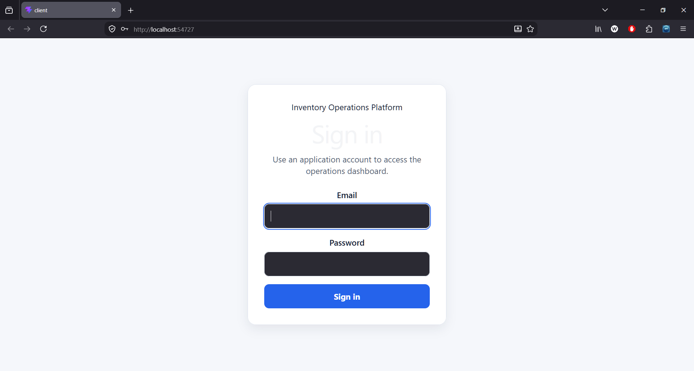
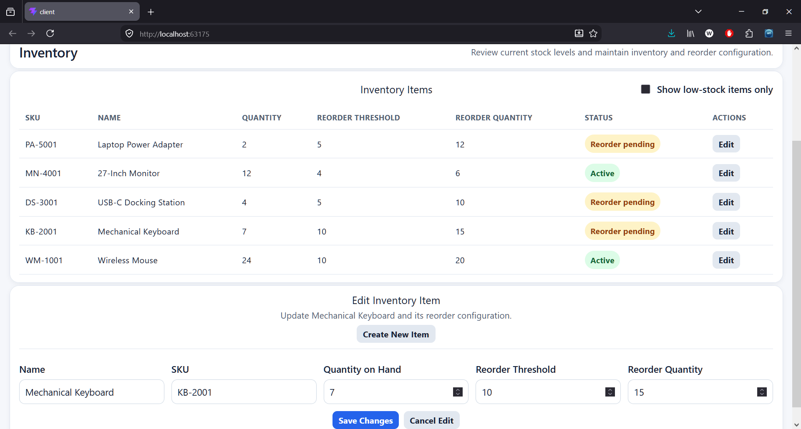
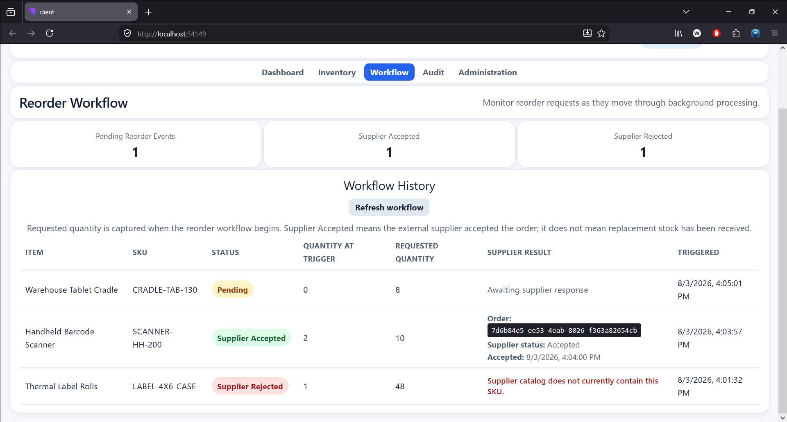
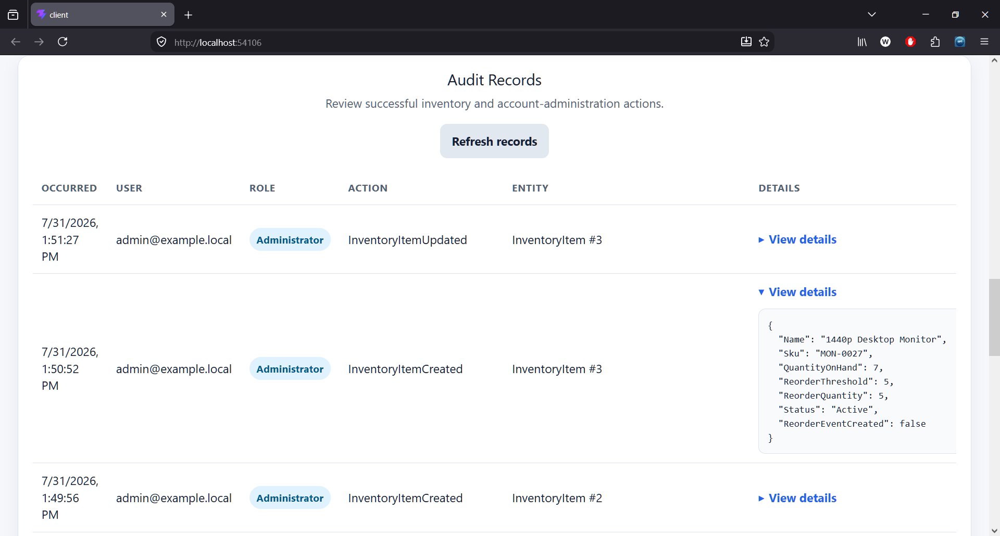
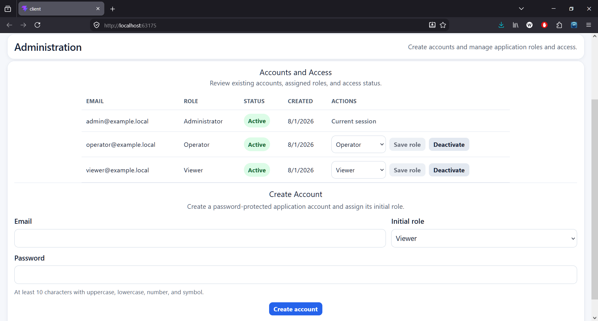

# Event-Driven Inventory Reorder Platform

A distributed .NET business application that models an internal inventory reorder workflow using an ASP.NET Core API, ASP.NET Core Identity, JWT bearer authentication, Azure-compatible queue messaging, a background Processor, an independently hosted mock supplier API, SQL Server, role-aware operations, OpenTelemetry diagnostics, and a React/TypeScript dashboard.

The project focuses on practical backend and distributed-system concerns while remaining fully reproducible with local, zero-cost infrastructure.

## What This Application Is

This application is a prototype internal operations system for organizations that keep physical inventory and need a reliable way to begin reordering before stock runs out. A warehouse, parts department, distributor, repair operation, or small manufacturer could use a system like this to track stock levels, define when each item should be reordered, control who is allowed to view or change inventory, and follow each reorder from the moment it is triggered through supplier acceptance or rejection.

For example, when an item falls below its configured threshold, the application creates a reorder request automatically and sends it to background processing rather than making the user wait for the entire workflow to finish. Staff can continue using the system while the request is processed. If the supplier is temporarily unavailable, the system can retry safely, and duplicate messages or repeated supplier submissions are prevented from creating duplicate orders. Administrators can also review who changed inventory or managed user accounts.

The application is designed with cloud deployment in mind. Its API, background worker, supplier integration, databases, message queue, health checks, distributed tracing, and containerized services are separated in ways that can map to managed cloud services. The repository runs locally through .NET Aspire and Docker so the complete system can be evaluated without paid infrastructure, but it does not claim an active production deployment, a real supplier connection, or completed production hardening.

## Screenshots

### JWT Login



The React client authenticates application-managed users through the login endpoint and keeps the returned JWT access token only in frontend memory.

### Operations Dashboard


The authenticated Dashboard presents inventory and workflow summary metrics beside a compact System Health card, while the persistent header keeps the signed-in user and assigned roles visible.

### Privileged Inventory Management



The Inventory view gives Operators and Administrators compact create and edit controls alongside the current inventory table. Successful mutations reload inventory, workflow, and health data from authoritative backend state.

### Low-Stock Review


The Inventory view can be narrowed to items requiring attention while retaining current quantity, reorder threshold, configured reorder quantity, status, and available management actions.

### Supplier Workflow History



The dedicated Workflow view shows pending, supplier-accepted, and supplier-rejected reorder events together with quantity-at-trigger, immutable requested quantity, supplier confirmation details, and readable rejection reasons. The view can refresh its data without clearing the in-memory login session.

### Administrator Audit Review



The Administrator-only Audit view presents successful inventory and account-management actions with actor, role, affected entity, occurrence time, and expandable action-specific details.

### Administrator Account Management



The Administrator-only Administration view supports account creation, role review and changes, and account deactivation or reactivation without exposing public registration.

### Correlated Workflow Diagnostics


Filtered Aspire structured logs show the same correlation identifier across API message publication, Processor receipt, typed supplier-client submission, supplier-service acceptance, local persistence, and successful Service Bus completion.

## Project Overview

Inventory items have current stock levels, reorder thresholds, and configurable reorder quantities. When an authenticated Operator or Administrator creates an item below its threshold, or updates an active item into a low-stock state, the API:

1. calculates the inventory status
2. changes the item to `ReorderPending`
3. creates a `Pending` reorder event containing the configured reorder quantity as an immutable requested-quantity snapshot
4. writes an audit record for the successful action
5. publishes a `ReorderRequestedMessage` containing the same requested quantity

A separate Processor consumes the message, checks the SQL-backed processed-message ledger, and submits the immutable reorder request to the independently hosted mock supplier API. The stable Service Bus message identifier is reused as the supplier `Idempotency-Key`, making redelivery safe across both the queue and HTTP boundaries.

When the supplier accepts the request, the Processor stores the supplier order identifier, supplier status, and UTC acceptance time before marking the reorder event `SupplierAccepted`. A permanent supplier rejection is stored as `SupplierRejected` together with its rejection reason.

Transient supplier failures remain retryable. The Processor records each failed attempt and abandons the Service Bus message so that redelivery can retry the same supplier submission with the same idempotency key. If the supplier accepted the order but the local database update initially fails, redelivery receives the original accepted supplier order rather than creating a duplicate.

A supplier-accepted reorder event does **not** mean that replacement stock has arrived. The Processor does not increase `QuantityOnHand`. The inventory item remains `ReorderPending` until a later inventory update raises its quantity above the reorder threshold.

The project intentionally models a focused internal business platform. The mock supplier service provides a realistic local integration boundary, but it is not presented as a real purchasing or supplier integration. The project also does not claim integration with an external enterprise identity provider, automated physical fulfillment, or production hosting.

### Inventory Quantity Semantics

The inventory and workflow models intentionally distinguish several related values:

| Value | Meaning |
| --- | --- |
| `QuantityOnHand` | Current physical stock recorded for the inventory item |
| `ReorderThreshold` | Stock level at or below which a reorder workflow is triggered |
| `ReorderQuantity` | Current configured amount to request when a future reorder workflow begins |
| `QuantityAtTrigger` | Snapshot of physical stock when a specific reorder event was created |
| `RequestedQuantity` | Immutable amount requested by that specific reorder event and message |

Changing an inventory item’s `ReorderQuantity` affects later reorder workflows only. It does not alter `RequestedQuantity` on previously created reorder events.

Supplier acceptance remains distinct from receiving replacement stock. Stock receipt is represented only by a later inventory update that increases `QuantityOnHand`.

## What This Project Demonstrates

- ASP.NET Core Web API design
- ASP.NET Core Identity with persistent application accounts
- signed JWT access tokens and policy-based role authorization
- Administrator-controlled account and role management
- role-aware React/TypeScript inventory operations
- responsive five-view frontend information architecture with compact, readable presentation
- Administrator-facing audit-trail review
- readable client handling for validation, forbidden, and invalidated-session responses
- background processing with a .NET Worker Service
- event-driven producer/consumer architecture
- Entity Framework Core with SQL Server
- configurable inventory reorder quantities
- immutable workflow snapshots across API, queue, Processor, HTTP, and persistence boundaries
- reliable, idempotent message processing
- retry and dead-letter behavior
- independently hosted mock external-service boundary
- typed `HttpClient` integration with supplier service discovery and Docker configuration
- stable idempotency across Service Bus delivery and supplier HTTP submission
- supplier acceptance and permanent-rejection workflow states
- retryable supplier failures handled through Service Bus redelivery
- recovery when external acceptance succeeds before local persistence
- idempotent supplier-order acceptance with durable replay protection
- separate supplier-owned persistence and migrations
- configurable delayed, transient-failure, and permanent-rejection behavior
- relational integration tests for HTTP, persistence, retry, and database-level idempotency
- SQL-backed audit, processing, and failure records
- correlation identifiers propagated through API, queue, Processor, and supplier
- structured logging and OpenTelemetry tracing through .NET Aspire
- frontend visibility into supplier order identifiers, statuses, acceptance times, and rejection reasons
- Docker-based local infrastructure
- Azure-compatible messaging through the Azure Service Bus Emulator
- production-oriented decisions without paid cloud infrastructure

## Key Engineering Areas

### Role-Aware Operations Client

The React/TypeScript client organizes authenticated work into five focused views:

- **Dashboard:** inventory and workflow summaries with application and database health
- **Inventory:** current stock, low-stock filtering, and Operator or Administrator create/edit controls
- **Workflow:** reorder-event history with quantity snapshots, supplier outcomes, confirmation details, rejection reasons, summary counts, and in-place refresh
- **Audit:** Administrator-only review of successful inventory and account-management actions
- **Administration:** Administrator-only account creation, role management, and activation controls

A persistent application header shows the signed-in account and roles, while semantic navigation identifies the active view. The layout is intentionally dense on wide screens and stacks cleanly at narrower widths; wide tables remain contained within their cards and can scroll horizontally when necessary.

Viewer sessions remain read-only. Operator sessions receive inventory-management controls but do not render or request Administrator-only audit or account-management data. The API independently enforces every authorization boundary and all inventory/workflow business rules.

The client maintains independent loading, empty, success, and error states for the data it presents. Successful mutations reload authoritative backend state rather than relying on speculative client updates. The Workflow History card can also refresh inventory and reorder-event data without reloading the browser page or clearing the in-memory login session.

Access tokens are retained only in frontend memory. Refreshing or closing the page clears the session and requires another login; refresh-token infrastructure and persistent browser sessions remain outside the project scope.

### Authentication, Authorization, and Audit Trail

The application uses ASP.NET Core Identity for persistent local user accounts and securely hashed passwords. Authenticated users obtain a signed JWT access token through:

```http
POST /api/auth/login
```

Protected requests send the token through the standard bearer-authentication header:

```http
Authorization: Bearer <access-token>
```

The application defines three roles:

| Role | Access |
| --- | --- |
| `Viewer` | Read inventory, reorder workflow history, and system health |
| `Operator` | Viewer access plus inventory creation and updates |
| `Administrator` | Operator access plus audit-record review and application-account management |

There is no public registration endpoint. The initial Administrator is created from local configuration, and subsequent accounts are created by an authenticated Administrator.

Administrator account-management capabilities include:

- listing application accounts and assigned roles
- creating password-protected accounts
- changing account roles
- deactivating and reactivating accounts
- preventing the final active Administrator from being demoted or deactivated

JWTs contain the authenticated user identity, assigned roles, and the account security stamp. Role or activation changes update the security stamp, causing previously issued tokens for that account to be rejected immediately.

Successful inventory and account-management actions create SQL-backed audit records containing the authenticated user, role, action, affected entity, UTC timestamp, and relevant change details.

The project uses local application-managed Identity accounts rather than claiming integration with an external enterprise identity provider, single sign-on platform, or production refresh-token infrastructure.

### Reliable Message Processing

The API publishes stable Service Bus message identifiers in this format:

```text
reorder-event-<ReorderEventId>
```

The Processor uses a SQL-backed `ProcessedMessages` ledger and a unique database index to make duplicate delivery harmless. A previously completed message is settled without repeating the supplier submission or local business result.

For supplier submission, the Processor sends the stable Service Bus message identifier as the HTTP `Idempotency-Key`. The supplier persists accepted orders under a unique database constraint and returns the original accepted result when the same key and payload are replayed.

This closes the distributed failure window in which the supplier accepts an order but the inventory database update fails. Service Bus redelivery repeats the request with the same idempotency key, the supplier returns the previously accepted order, and the Processor can complete the local transaction without creating another supplier order.

Permanent supplier rejection is a handled terminal business outcome. It produces a `SupplierRejected` reorder event and completes the Service Bus message. Transient HTTP failures create `FailedMessages` records and remain retryable through abandonment and redelivery until the configured delivery limit is reached.

Malformed or unsupported payloads are dead-lettered immediately. Repeatedly failing technical submissions are dead-lettered after the configured maximum delivery attempts.

This design accepts at-least-once delivery and applies idempotency at every side-effect boundary rather than claiming exactly-once execution.

### Mock Supplier Boundary

`InventoryReorderPlatform.SupplierMockApi` models an external supplier-order HTTP boundary without depending on a paid service or cloud environment.

The service owns its request and response contracts, EF Core context, migrations, accepted-order model, and SQL database. It does not reference the inventory API, shared application data project, Processor, or internal Service Bus message contract.

The background Processor calls the supplier endpoint after consuming a valid reorder message. It sends:

- the stable Service Bus message identifier as `Idempotency-Key`
- the workflow correlation identifier as `X-Correlation-Id`
- the immutable reorder-event identifiers, SKU, requested quantity, and trigger time

A valid new submission returns `201 Created`. Repeating the same key and payload returns the original accepted order with `200 OK`, while conflicting reuse of an existing key returns `409 Conflict`.

A unique SQL index provides database-level duplicate protection. Accepted supplier orders therefore survive service restarts and do not rely on an in-memory deduplication cache.

The service supports four local simulation modes:

- `Normal`
- `Delayed`
- `TransientFailure`
- `PermanentRejection`

A `422 Unprocessable Entity` response becomes a terminal `SupplierRejected` workflow result. Other unexpected or transient HTTP failures remain retryable through Service Bus redelivery. Previously accepted submissions are returned before behavior simulation is applied, ensuring that a retry cannot turn an already accepted order into a later simulated failure.

Detailed contracts, status codes, configuration, Processor behavior, and verification steps are documented in [Mock Supplier Service](docs/mock-supplier-service.md).

### Observability

Each API request accepts or generates an `X-Correlation-Id`. The API returns the identifier to the caller, includes it in structured diagnostics, and propagates it through the Service Bus message.

The Processor propagates the same identifier to the supplier HTTP request. Important log messages in the API, Processor, typed supplier client, and supplier service include the correlation identifier directly for plain-text filtering.

The API also propagates W3C trace context through Service Bus. Custom OpenTelemetry activities represent the application-owned messaging boundaries:

- `PublishReorderMessage`
- `ProcessReorderMessage`

The outgoing supplier HTTP request is instrumented beneath the consumer activity, allowing the Aspire trace to follow the workflow through:

```text
Inventory API
└── PublishReorderMessage
    └── ProcessReorderMessage
        └── POST /api/supplier-orders
```

Aspire provides a local view of resource health, structured logs, metrics, and distributed traces. Detailed tracing and troubleshooting steps are documented in the [observability runbook](docs/observability-runbook.md).

## Architecture

See [System Architecture](docs/architecture.md) for the component diagram, runtime boundaries, message flow, persistence responsibilities, observability design, and intentional project limitations.

## Tech Stack

- C#
- .NET 10
- ASP.NET Core Web API
- ASP.NET Core Identity
- JWT bearer authentication
- .NET Worker Service
- .NET Aspire
- Entity Framework Core
- SQL Server
- Azure Service Bus client libraries
- Azure Service Bus Emulator
- Docker and Docker Compose
- React 19
- TypeScript
- Vite
- xUnit v3
- OpenTelemetry

## Solution Structure

| Project | Responsibility |
| --- | --- |
| `InventoryReorderPlatform.AppHost` | Orchestrates the API, Processor, mock supplier API, React/Vite client, and application and supplier databases during Aspire development |
| `InventoryReorderPlatform.ServiceDefaults` | Provides shared health, logging, metrics, tracing, and OpenTelemetry configuration |
| `InventoryReorderPlatform.Api` | Provides authentication, account administration, inventory operations, reorder visibility, health reporting, authorization, auditing, and message publication |
| `InventoryReorderPlatform.Processor` | Consumes reorder messages, submits idempotent supplier orders, persists accepted or rejected outcomes, records failures, retries technical errors, and dead-letters exhausted messages |
| `InventoryReorderPlatform.Data` | Contains the shared EF Core context, Identity and domain models, migrations, and persistence configuration |
| `InventoryReorderPlatform.Contracts` | Contains messaging contracts and shared configuration models |
| `InventoryReorderPlatform.Api.Tests` | Contains authentication, authorization, account-management, auditing, middleware, and API workflow integration tests |
| `InventoryReorderPlatform.Processor.Tests` | Contains processor reliability, supplier-client, retry/recovery, rejection, and idempotency tests |
| `client` | Contains the authenticated, role-aware React/TypeScript operations client, supplier workflow visibility, refresh controls, and five application views |
| `InventoryReorderPlatform.SupplierMockApi` | Provides an independently hosted mock supplier-order HTTP boundary with idempotent acceptance, separate persistence, failure simulation, health endpoints, and OpenAPI |
| `InventoryReorderPlatform.SupplierMockApi.Tests` | Contains supplier endpoint, persistence, idempotency, and configurable-behavior integration tests |

## Core Workflow

1. An authenticated Operator or Administrator creates or updates an inventory item.
2. The API validates the request and applies the authorization policy.
3. An item at or below its reorder threshold enters `ReorderPending`.
4. The API creates a `Pending` reorder event containing an immutable requested-quantity snapshot.
5. The API records the successful user action in the audit trail.
6. The API publishes a stable, correlated `ReorderRequestedMessage`.
7. The Processor checks whether the message has already been handled.
8. The Processor submits the reorder to the supplier using the Service Bus message identifier as the supplier idempotency key.
9. Supplier acceptance changes the reorder event to `SupplierAccepted` and stores the supplier order identifier, status, and acceptance time.
10. Permanent supplier rejection changes the event to `SupplierRejected`, stores the rejection reason, and completes the message without retry.
11. A transient supplier failure is recorded and abandoned for Service Bus redelivery.
12. Redelivery reuses the same supplier idempotency key and cannot create a duplicate supplier order.
13. A repeatedly failing technical submission is moved to the dead-letter queue after the configured delivery limit.
14. The inventory item remains `ReorderPending` until stock is later updated above the threshold.

The application keeps five related concerns distinct:

- **Inventory state:** whether physical stock is healthy or requires reordering
- **Reorder-event state:** whether the supplier submission is pending, accepted, rejected, or a legacy pre-supplier processed event
- **Supplier-order state:** the external order identifier, status, acceptance time, or rejection reason
- **Message-processing state:** whether delivery succeeded, was skipped as a duplicate, or failed
- **Audit state:** which authenticated application user performed a successful inventory or account-management action

## Running Locally

### Prerequisites

Install:

- .NET 10 SDK
- Node.js and npm
- Docker Desktop or another Docker Compose-compatible environment

Install the frontend dependencies once:

```bash
cd client
npm install
cd ..
```

The project supports two local run modes.

### Local Authentication Configuration

The API requires local authentication settings that must not be committed to source control.

For Aspire development, configure them through ASP.NET Core User Secrets for the API project:

```cmd
dotnet user-secrets set "Jwt:SigningKey" "<long-random-local-signing-key>" --project InventoryReorderPlatform.Api
dotnet user-secrets set "BootstrapAdmin:Email" "<local-administrator-email>" --project InventoryReorderPlatform.Api
dotnet user-secrets set "BootstrapAdmin:Password" "<strong-local-administrator-password>" --project InventoryReorderPlatform.Api
dotnet user-secrets set "HttpTesting:AccountPassword" "<strong-local-test-account-password>" --project InventoryReorderPlatform.Api
```

The Administrator and manual-test passwords must satisfy the configured Identity policy:

- at least 10 characters
- at least one uppercase letter
- at least one lowercase letter
- at least one number
- at least one non-alphanumeric character

On application startup, the API creates the Viewer, Operator, and Administrator roles. When valid bootstrap credentials are configured, it also creates the initial Administrator if that account does not already exist.

For Docker/local mode, copy `.env.example` to an ignored `.env` file and provide local values for:

```dotenv
JWT_SIGNING_KEY=<long-random-local-signing-key>
BOOTSTRAP_ADMIN_EMAIL=<local-administrator-email>
BOOTSTRAP_ADMIN_PASSWORD=<strong-local-administrator-password>
```

Docker Compose injects these values into the API container. The actual .env file is excluded from source control; only the placeholder .env.example file is tracked.

No real secret values are stored in the repository. Tracked configuration contains placeholders and disposable local-development defaults only.

### Aspire Mode

Aspire mode is the preferred option for normal development, resource health, structured logs, metrics, and distributed traces.

Aspire runs:

- the ASP.NET Core inventory API
- the background Processor
- the mock supplier API
- the React/Vite client
- one local SQL Server resource
- the inventory application database
- the independently owned supplier database

The Service Bus Emulator and its SQL dependency remain external local containers.

#### 1. Start the Service Bus Emulator

From the repository root:

```bash
docker compose -f docker-compose.local.yml up -d sb-emulator-sql servicebus-emulator
```

Confirm that the containers are running:

```bash
docker compose -f docker-compose.local.yml ps
```

#### 2. Start Aspire

```bash
dotnet run --project InventoryReorderPlatform.AppHost
```

Open the Aspire dashboard URL printed in the terminal.

The mock supplier resource exposes health, liveness, and OpenAPI endpoints through its dynamically assigned Aspire address. Its accepted orders are stored in the separate `supplierdb` database.

The `client` resource is started automatically. Open its endpoint from the Aspire dashboard. Aspire supplies the current API endpoint to Vite, so no manual API URL editing is required for the frontend.

#### 3. Sign in and exercise the workflow

Open the `client` endpoint from the Aspire dashboard and sign in using the configured bootstrap Administrator account.

The access token is retained only in frontend memory. Refreshing or closing the page clears the current session and requires another login.

For direct and repeatable API verification, use:

```text
InventoryReorderPlatform.Api/InventoryReorderPlatform.Api.http
```

The request file is configured for Aspire mode by default and uses the `local` HTTP environment. Credentials are resolved through ASP.NET Core User Secrets rather than being stored in the file.

When using the fixed identifiers and expected counts in that file:

1. begin with an empty application database
2. select the `local` HTTP environment
3. execute the requests from top to bottom
4. run the named Administrator login request first
5. create and authenticate the Viewer and Operator test accounts before executing role-specific requests

#### 4. Shut down Aspire mode

Stop the AppHost with `Ctrl+C`, then stop the emulator containers:

```bash
docker compose -f docker-compose.local.yml stop servicebus-emulator sb-emulator-sql
```

To remove the stopped containers and Compose network:

```bash
docker compose -f docker-compose.local.yml down
```

Do not add `-v` unless a full local data reset is intended.

### Docker / Local Stack Mode

Docker/local mode runs the backend and infrastructure as a complete Compose stack:

- application SQL Server
- inventory application database
- independent supplier database
- Service Bus Emulator
- Service Bus Emulator SQL dependency
- Service Bus readiness gating
- inventory API
- mock supplier API
- Processor

Start the stack from the repository root:

```bash
docker compose -f docker-compose.local.yml up -d --build
docker compose -f docker-compose.local.yml ps
```

The API is exposed at:

```text
http://localhost:8080
```

The mock supplier API is exposed at:

```text
http://localhost:8082
```

Useful supplier endpoints include:

```text
http://localhost:8082/health
http://localhost:8082/alive
http://localhost:8082/openapi/v1.json
```

Start the React client separately:

```bash
cd client
npm run dev
```

The Vite development server defaults to:

```text
http://localhost:5173
```

Outside Aspire, Vite proxies `/api` requests to `http://localhost:8080` unless `VITE_API_PROXY_TARGET` is configured.

Useful backend commands:

```bash
docker compose -f docker-compose.local.yml logs -f api
docker compose -f docker-compose.local.yml logs -f supplier
docker compose -f docker-compose.local.yml logs -f processor
docker compose -f docker-compose.local.yml logs servicebus-emulator
docker compose -f docker-compose.local.yml down
```

See the [frontend README](client/README.md) for client configuration and available npm scripts.

### Frontend Configuration

Optional frontend settings can be placed in `client/.env.local`:

```env
VITE_API_PROXY_TARGET=http://localhost:8080
VITE_PORT=5173
```

When Aspire starts the frontend, its injected API endpoint takes precedence over `VITE_API_PROXY_TARGET`.

Authentication credentials and JWT signing configuration belong to the API configuration. They must not be placed in frontend environment files.

### Local Reset

To remove local application data and recreate the Docker/local stack:

```bash
docker compose -f docker-compose.local.yml down -v
docker compose -f docker-compose.local.yml up -d --build
```

The `-v` option should be used only when a complete local reset is intended.

## API Access

### Login

Authenticate through:

```http
POST /api/auth/login
Content-Type: application/json

{
  "email": "administrator@example.local",
  "password": "<local-password>"
}
```

A successful response includes a signed JWT access token and the account’s assigned roles.

### Protected requests

Send the returned token through the bearer-authentication header:

```http
GET /api/inventoryitems
Authorization: Bearer <access-token>
Accept: application/json
```

Key protected endpoints include:

```text
GET    /api/inventoryitems
GET    /api/inventoryitems/{id}
POST   /api/inventoryitems
PUT    /api/inventoryitems/{id}
GET    /api/reorderevents
GET    /api/operations/health
GET    /api/audit-records
GET    /api/accounts
POST   /api/accounts
PATCH  /api/accounts/{id}/role
PATCH  /api/accounts/{id}/status
```

Inventory creation and update requests require the Operator or Administrator role.

Inventory create and update payloads use the same required business fields:

```json
{
  "name": "Mechanical Keyboard",
  "sku": "KEY-1001",
  "quantityOnHand": 20,
  "reorderThreshold": 5,
  "reorderQuantity": 10
}
```

`reorderQuantity` must be greater than zero. When an item transitions into `ReorderPending`, the API copies that configured value into the resulting reorder event and `ReorderRequestedMessage` as `requestedQuantity`.

Reorder-event responses expose supplier workflow details when available:

- `supplierOrderId`
- `supplierOrderStatus`
- `supplierAcceptedAtUtc`
- `supplierRejectionReason`

The event `status` is `Pending`, `SupplierAccepted`, or `SupplierRejected` for current workflows. Legacy `Processed` rows may remain from workflows completed before supplier submission was introduced.

Audit-record access and all account-management requests require the Administrator role.

### OpenAPI documents

In Development mode, both APIs expose generated OpenAPI documents:

```text
Inventory API: /openapi/v1.json
Supplier API:  /openapi/v1.json
```

The inventory document defines JWT bearer authentication for protected operations while leaving the login endpoint anonymous. Both documents include operation summaries, expected response codes, validation constraints, and practical request and response examples.

For the complete human-readable contract, see the [API reference](docs/api-reference.md).

The complete authenticated manual-verification sequence is maintained in:

```text
InventoryReorderPlatform.Api/InventoryReorderPlatform.Api.http
```

## Testing and Validation

Run the backend test suite from the repository root:

```bash
dotnet test
```

The automated tests verify:

- valid credentials issue a signed JWT containing the expected issuer, audience, identity, and roles
- invalid credentials are rejected without revealing whether an account exists
- protected endpoints require a valid bearer token
- inactive accounts cannot authenticate or continue using previously issued tokens
- changing an account role invalidates previously issued tokens
- Viewer, Operator, and Administrator policies enforce the intended access boundaries
- Administrators can create, list, update, deactivate, and reactivate accounts
- duplicate emails, invalid roles, and weak passwords are rejected
- the final active Administrator cannot be demoted or deactivated
- account-management actions create audit records
- successful supplier submission updates the reorder event to `SupplierAccepted`
- accepted and permanently rejected terminal outcomes create a processed-message ledger entry
- duplicate delivery does not repeat the business result
- failed processing creates a persisted failure record
- the correlation middleware generates an identifier when one is absent
- the correlation middleware preserves and returns a caller-supplied identifier
- isolated API-to-processor workflow behavior is covered by the production-oriented test suite
- inventory creation and updates validate positive configured reorder quantities
- reorder events and messages preserve the requested quantity captured when the workflow begins
- later inventory configuration changes do not rewrite historical requested quantities
- duplicate and recovered Processor handling preserve the original requested-quantity snapshot
- valid supplier-order acceptance and persistence
- identical idempotent replay returning the original accepted order
- conflicting idempotency-key reuse
- database-level uniqueness enforcement
- delayed supplier responses
- transient supplier failure followed by recovery
- permanent supplier rejection without persistence
- supplier-client request headers, response validation, and delayed completion
- transient supplier failure followed by successful Service Bus-style redelivery
- permanent supplier rejection persisted as a terminal workflow outcome
- supplier acceptance followed by an initial local-save failure
- redelivery completing local persistence without creating a second supplier order

Run the frontend checks with:

```bash
cd client
npm run lint
npm run build
```

Direct Azure Service Bus settlement tests are not currently included because the Worker depends on concrete transport types. Retry, dead-letter, and cross-service workflow behavior can be exercised with the local Service Bus Emulator.

## Documentation

Each document has a focused purpose:

- [API reference](docs/api-reference.md) — inventory and supplier endpoints, authentication, authorization, models, validation rules, status codes, headers, and examples
- [Operational runbook](docs/operational-runbook.md) — local configuration, Aspire and Docker startup, authentication, health checks, supplier behavior, shutdown, and reset procedures
- [Expansion roadmap](docs/inventory-operations-roadmap.md) — completed expansion scope and final verification status
- [System architecture](docs/architecture.md) — components, runtime boundaries, data flow, persistence responsibilities, messaging, authentication, supplier integration, and observability design
- [Engineering case study](docs/inventory-operations-case-study.md) — design decisions, rationale, tradeoffs, automated verification, and portfolio value
- [Failure scenarios](docs/failure-scenarios.md) — expected failure behavior, recovery expectations, evidence, and known limitations
- [Observability runbook](docs/observability-runbook.md) — operational steps for tracing and diagnosing a correlated reorder workflow
- [Mock supplier service](docs/mock-supplier-service.md) — supplier contracts, idempotency behavior, simulation modes, persistence ownership, runtime configuration, and verification
- [Frontend README](client/README.md) — client startup, proxy configuration, environment settings, and npm scripts

All 12 expansion phases are complete. The final phase added complete inventory and supplier API reference documentation, generated OpenAPI metadata and examples, JWT bearer security metadata, and a consolidated operational runbook.

Final verification covered the automated backend and frontend checks, Aspire and Docker/local runtime modes, normal and delayed supplier acceptance, transient failure recovery, permanent rejection, duplicate-submission idempotency, distributed tracing, and committed configuration safety.

## Scope and Limitations

### In Scope

- inventory tracking and reorder-threshold logic
- event-driven API and Worker separation
- reliable and idempotent message consumption
- retry and dead-letter behavior
- relational business, Identity, audit, and processing data
- persistent ASP.NET Core Identity application accounts
- signed JWT access tokens and role-based authorization
- Administrator-controlled account and role management
- role-aware API and frontend inventory operations
- responsive Dashboard, Inventory, Workflow, Audit, and Administration views
- Administrator audit and account-management interfaces
- local health, logs, metrics, and traces
- configurable reorder quantities and immutable per-event requested-quantity snapshots
- independently hosted mock supplier HTTP boundary
- supplier-owned persistence and migrations
- durable supplier-order idempotency across Service Bus redelivery
- configurable supplier delay, transient failure, and rejection simulation
- typed Processor-to-supplier HTTP integration
- visible pending, accepted, and rejected supplier workflow outcomes
- end-to-end correlation across API, queue, Processor, and supplier
- Aspire and Docker-based development modes
- Azure-compatible, zero-cost local messaging

### Out of Scope

- external enterprise identity-provider or single-sign-on integration
- refresh-token infrastructure and persistent browser sessions
- public self-service registration
- integration with a real commercial supplier or purchasing platform
- automated physical inventory receipt
- automated dead-letter replay
- transactional outbox processing
- production cloud hosting
- production telemetry retention and alerting
- Kubernetes
- a general-purpose inventory-management platform

## Portfolio Positioning

This project is positioned primarily as evidence of practical C#/.NET backend and distributed-system work: authenticated ASP.NET Core APIs, SQL-backed business state, reliable queue processing, idempotent service-to-service HTTP integration, auditing, diagnostics, and automated integration tests.

The React client demonstrates that those backend capabilities are usable through a compact, responsive, role-aware internal business interface rather than existing only as isolated endpoints. The service boundaries, containerization, message-driven processing, health checks, and observability design are intended to support a future move to managed cloud services, although this repository does not claim an active production deployment. Claims remain deliberately conservative, and the full system can be reproduced locally without paid cloud services.

## License

This project is licensed under the MIT License. See the [LICENSE](LICENSE) file for details.
