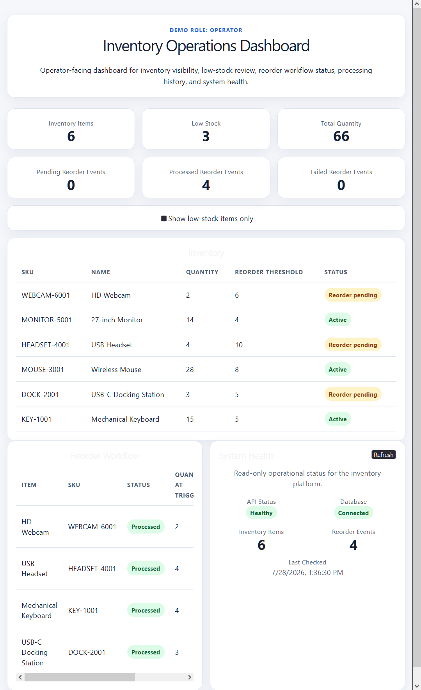
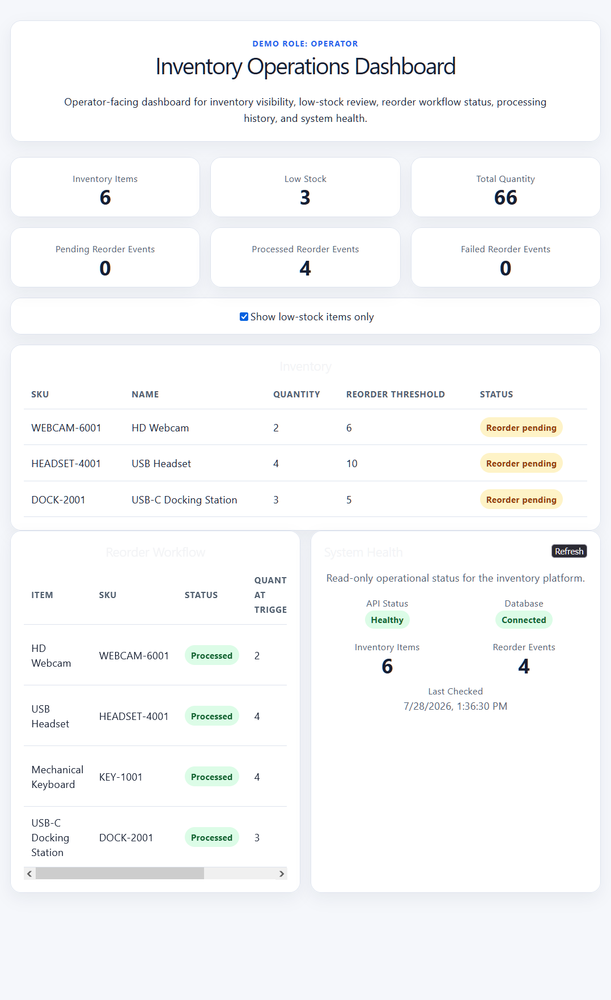
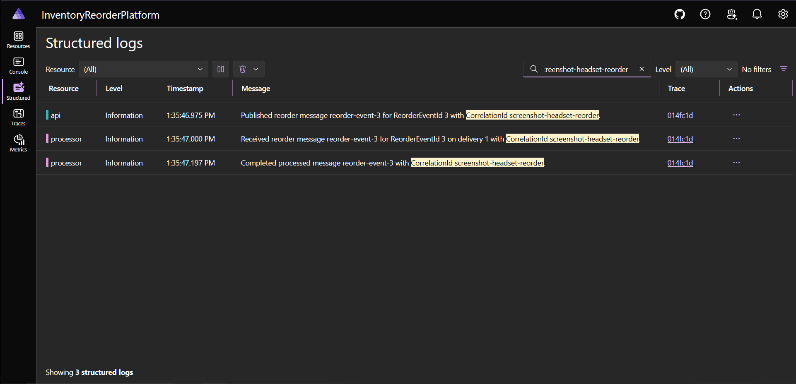

# Event-Driven Inventory Reorder Platform

A distributed .NET business application that models an internal inventory reorder workflow using an ASP.NET Core API, a background Processor, SQL Server, Azure-compatible queue messaging, role-aware operations, OpenTelemetry diagnostics, and a React/TypeScript dashboard.

The project focuses on practical backend and distributed-system concerns while remaining fully reproducible with local, zero-cost infrastructure.

## Screenshots

### Operations Dashboard



The React/TypeScript dashboard combines inventory and workflow summary metrics, inventory status, reorder-processing history, and application health in one operator-facing view.

### Low-Stock Review



The low-stock filter narrows the inventory table to items requiring attention while retaining workflow and system-health context.

### Correlated Workflow Diagnostics



Filtered Aspire structured logs show the same correlation identifier across API message publication, Processor receipt, and successful message completion.

## Project Overview

Inventory items have stock levels and reorder thresholds. When an authenticated Operator or Administrator creates an item below its threshold, or updates an active item into a low-stock state, the API:

1. calculates the inventory status
2. changes the item to `ReorderPending`
3. creates a `Pending` reorder event
4. writes an audit record for the successful action
5. publishes a `ReorderRequestedMessage`

A separate Processor consumes the message, applies duplicate protection, performs the internal reorder-request workflow, records successful processing, and changes the reorder event to `Processed`.

A processed reorder event does **not** mean that replacement stock has arrived. The Processor does not increase `QuantityOnHand`. The inventory item remains `ReorderPending` until a later inventory update raises its quantity above the reorder threshold.

The project intentionally models a focused internal business platform. It does not claim a production identity provider, a real supplier integration, automated purchasing, or physical inventory fulfillment.

## What This Project Demonstrates

- ASP.NET Core Web API design
- background processing with a .NET Worker Service
- event-driven producer/consumer architecture
- Entity Framework Core with SQL Server
- reliable, idempotent message processing
- retry and dead-letter behavior
- policy-based authorization and role-aware operations
- SQL-backed audit, processing, and failure records
- React/TypeScript operational visibility
- structured logging and correlation identifiers
- OpenTelemetry tracing through .NET Aspire
- Docker-based local infrastructure
- Azure-compatible messaging through the Azure Service Bus Emulator
- production-oriented decisions without paid cloud infrastructure

## Key Engineering Areas

### Operations Dashboard

The React/TypeScript client provides:

- inventory and workflow summary metrics
- inventory status and quantity visibility
- low-stock filtering
- reorder-event processing history
- application and database health information
- independent dashboard and health loading/error states
- a visible local demo-role indicator

The dashboard consumes protected backend endpoints and does not duplicate inventory-status or reorder-workflow business rules in the client.

### Authorization and Audit Trail

The API uses local demo authentication through the `X-Demo-User` header and ASP.NET Core authorization policies.

| Header value | Role | Access |
| --- | --- | --- |
| `viewer` | Viewer | Read inventory, reorder workflow, and system health |
| `operator` | Operator | Viewer access plus inventory creation and updates |
| `admin` | Administrator | Operator access plus audit-record review |

Successful inventory creation and update operations create SQL-backed audit records containing the user, role, action, affected entity, UTC timestamp, and relevant change details.

The authentication scheme is intentionally local and portfolio-focused. It demonstrates claims, roles, authentication handlers, and authorization policies without presenting itself as a production identity solution.

### Reliable Message Processing

The API publishes stable Service Bus message identifiers in this format:

```text
reorder-event-<ReorderEventId>
```

The Processor uses a SQL-backed `ProcessedMessages` ledger and a unique database index to make duplicate delivery harmless. A previously processed message is completed without repeating the business result.

Valid failures create `FailedMessages` records. Retryable failures are abandoned until the configured maximum delivery count is reached, after which the message is moved to the dead-letter queue. Malformed or unsupported payloads are dead-lettered immediately.

This design accepts at-least-once delivery and applies idempotent processing rather than claiming exactly-once messaging.

### Observability

Each API request accepts or generates an `X-Correlation-Id`. The API returns the identifier to the caller, includes it in structured diagnostics, and propagates it through the Service Bus message.

The API also propagates W3C trace context to the Processor. Custom OpenTelemetry activities represent the application-owned messaging boundaries:

- `PublishReorderMessage`
- `ProcessReorderMessage`

Aspire provides a local view of resource health, structured logs, metrics, and distributed traces. Detailed tracing and troubleshooting steps are documented in the [observability runbook](docs/observability-runbook.md).

## Tech Stack

- C#
- .NET 10
- ASP.NET Core Web API
- .NET Worker Service
- .NET Aspire
- Entity Framework Core
- SQL Server
- Azure Service Bus client libraries
- Azure Service Bus Emulator
- Docker and Docker Compose
- React 19
- TypeScript
- Vite
- xUnit v3
- OpenTelemetry

## Solution Structure

| Project | Responsibility |
| --- | --- |
| `InventoryReorderPlatform.AppHost` | Orchestrates the API, Processor, React/Vite client, and application SQL Server during Aspire development |
| `InventoryReorderPlatform.ServiceDefaults` | Provides shared health, logging, metrics, tracing, and OpenTelemetry configuration |
| `InventoryReorderPlatform.Api` | Provides inventory operations, reorder visibility, health reporting, demo authentication, authorization, auditing, and message publication |
| `InventoryReorderPlatform.Processor` | Consumes reorder messages, applies idempotency, records processing outcomes, retries failures, and dead-letters unprocessable messages |
| `InventoryReorderPlatform.Data` | Contains the shared EF Core context, entity models, migrations, and persistence configuration |
| `InventoryReorderPlatform.Contracts` | Contains messaging contracts and shared configuration models |
| `InventoryReorderPlatform.Api.Tests` | Contains API middleware integration tests |
| `InventoryReorderPlatform.Processor.Tests` | Contains processor reliability tests |
| `client` | Contains the React/TypeScript operations dashboard |

## Core Workflow

1. An Operator or Administrator creates or updates an inventory item.
2. The API validates the request and applies the authorization policy.
3. An item at or below its reorder threshold enters `ReorderPending`.
4. The API creates a `Pending` reorder event and an audit record.
5. The API publishes a stable, correlated reorder message.
6. The Processor checks whether the message has already been handled.
7. A new valid message is processed and recorded in `ProcessedMessages`.
8. The reorder event changes to `Processed`.
9. A duplicate delivery is completed without repeating the business operation.
10. A retryable failure is recorded and abandoned for another delivery attempt.
11. A repeatedly failing message is moved to the dead-letter queue.
12. The inventory item remains `ReorderPending` until stock is later updated above the threshold.

The application keeps four related concerns distinct:

- **Inventory state:** whether stock is healthy or requires reordering
- **Reorder-event state:** whether the internal reorder request is pending or processed
- **Message-processing state:** whether delivery succeeded, was skipped as a duplicate, or failed
- **Audit state:** which authenticated demo user performed a successful inventory action

## Running Locally

### Prerequisites

Install:

- .NET 10 SDK
- Node.js and npm
- Docker Desktop or another Docker Compose-compatible environment

Install the frontend dependencies once:

```bash
cd client
npm install
cd ..
```

The project supports two local run modes.

### Aspire Mode

Aspire mode is the preferred option for normal development, resource health, structured logs, metrics, and distributed traces.

Aspire runs:

- the ASP.NET Core API
- the background Processor
- the React/Vite client
- the application SQL Server and database

The Service Bus Emulator and its SQL dependency remain external local containers.

#### 1. Start the Service Bus Emulator

From the repository root:

```bash
docker compose -f docker-compose.local.yml up -d \
  sb-emulator-sql servicebus-emulator
```

Confirm that the containers are running:

```bash
docker compose -f docker-compose.local.yml ps
```

#### 2. Start Aspire

```bash
dotnet run --project InventoryReorderPlatform.AppHost
```

Open the Aspire dashboard URL printed in the terminal.

The `client` resource is started automatically. Open its endpoint from the Aspire dashboard. Aspire supplies the current API endpoint to Vite, so no manual API URL editing is required for the frontend.

The client uses the `operator` demo identity by default.

#### 3. Exercise the workflow

Use the structured request file:

```text
InventoryReorderPlatform.Api/InventoryReorderPlatform.Api.http
```

When using the fixed identifiers and expected counts in that file, begin with an empty application database and execute the requests from top to bottom.

Use the current Aspire API endpoint shown in the dashboard for direct `.http` requests.

#### 4. Shut down Aspire mode

Stop the AppHost with `Ctrl+C`, then stop the emulator containers:

```bash
docker compose -f docker-compose.local.yml stop \
  servicebus-emulator sb-emulator-sql
```

To remove the stopped containers and Compose network:

```bash
docker compose -f docker-compose.local.yml down
```

Do not add `-v` unless a full local data reset is intended.

### Docker / Local Stack Mode

Docker/local mode runs the backend and infrastructure as a complete Compose stack:

- application SQL Server
- Service Bus Emulator
- Service Bus Emulator SQL dependency
- Service Bus readiness gating
- API
- Processor

Start the stack from the repository root:

```bash
docker compose -f docker-compose.local.yml up -d --build
docker compose -f docker-compose.local.yml ps
```

The API is exposed at:

```text
http://localhost:8080
```

Start the React client separately:

```bash
cd client
npm run dev
```

The Vite development server defaults to:

```text
http://localhost:5173
```

Outside Aspire, Vite proxies `/api` requests to `http://localhost:8080` unless `VITE_API_PROXY_TARGET` is configured.

Useful backend commands:

```bash
docker compose -f docker-compose.local.yml logs -f api
docker compose -f docker-compose.local.yml logs -f processor
docker compose -f docker-compose.local.yml logs servicebus-emulator
docker compose -f docker-compose.local.yml down
```

See the [frontend README](client/README.md) for client configuration and available npm scripts.

### Frontend Configuration

Optional frontend settings can be placed in `client/.env.local`:

```env
VITE_API_PROXY_TARGET=http://localhost:8080
VITE_DEMO_USER=operator
VITE_PORT=5173
```

Supported demo identities are:

- `viewer`
- `operator`
- `admin`

When Aspire starts the frontend, its injected API endpoint takes precedence over `VITE_API_PROXY_TARGET`.

### Local Reset

To remove local application data and recreate the Docker/local stack:

```bash
docker compose -f docker-compose.local.yml down -v
docker compose -f docker-compose.local.yml up -d --build
```

The `-v` option should be used only when a complete local reset is intended.

## API Access

Key protected endpoints include:

```http
GET /api/inventoryitems
X-Demo-User: viewer
```

```http
GET /api/reorderevents
X-Demo-User: viewer
```

```http
GET /api/operations/health
X-Demo-User: viewer
```

```http
GET /api/audit-records
X-Demo-User: admin
```

Inventory creation and update requests require the Operator or Administrator role.

## Testing and Validation

Run the backend test suite from the repository root:

```bash
dotnet test
```

The current automated tests verify:

- successful processor handling updates the reorder event
- successful handling creates a processed-message ledger entry
- duplicate delivery does not repeat the business result
- failed processing creates a persisted failure record
- the correlation middleware generates an identifier when one is absent
- the correlation middleware preserves and returns a caller-supplied identifier

Run the frontend checks with:

```bash
cd client
npm run lint
npm run build
```

Direct Azure Service Bus settlement tests are not currently included because the Worker depends on concrete transport types. Retry, dead-letter, and cross-service workflow behavior can be exercised with the local Service Bus Emulator. Additional authorization, recovery, and container-backed end-to-end tests are tracked in the project roadmap.

## Documentation

Each document has a focused purpose:

- [Expansion roadmap](docs/inventory-operations-roadmap.md) — completed and remaining expansion scope
- [Engineering case study](docs/inventory-operations-case-study.md) — design decisions, rationale, tradeoffs, and portfolio value
- [Failure scenarios](docs/failure-scenarios.md) — expected failure behavior, recovery expectations, evidence, and known limitations
- [Observability runbook](docs/observability-runbook.md) — operational steps for tracing and diagnosing a workflow
- [Frontend README](client/README.md) — client-specific startup, proxy configuration, environment settings, and scripts

The operations dashboard, authorization and audit work, reliable message processing, and observability phases are complete. Remaining production-oriented test and documentation work is tracked in the roadmap.

## Scope and Limitations

### In Scope

- inventory tracking and reorder-threshold logic
- event-driven API and Worker separation
- reliable and idempotent message consumption
- retry and dead-letter behavior
- relational business, audit, and processing data
- role-aware API operations
- operator-facing dashboard visibility
- local health, logs, metrics, and traces
- Aspire and Docker-based development modes
- Azure-compatible, zero-cost local messaging

### Out of Scope

- production identity-provider integration
- persistent user-account management
- real purchasing or supplier integrations
- automated physical inventory receipt
- automated dead-letter replay
- transactional outbox processing
- production cloud hosting
- production telemetry retention and alerting
- Kubernetes
- a general-purpose inventory-management platform

## Portfolio Positioning

This project demonstrates practical C#/.NET backend and distributed-system work through:

- an ASP.NET Core API producer
- a background Worker consumer
- SQL Server persistence
- reliable queue-based processing
- role-aware operations and SQL-backed auditing
- an operator-facing React dashboard
- correlated logs and distributed tracing
- Aspire and Docker local orchestration
- Azure-compatible messaging
- automated reliability and middleware tests

The implementation keeps its claims conservative and can be reproduced locally without paid cloud services.

## License

This project is licensed under the MIT License. See the [LICENSE](LICENSE) file for details.
