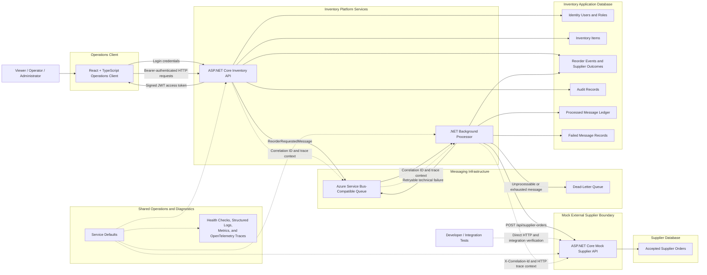

# System Architecture

## Overview

The Event-Driven Inventory Reorder Platform is a distributed .NET business application with separate user-interface, API, authentication, messaging, background-processing, external-service, observability, and persistence responsibilities.

The architecture uses asynchronous message processing for reorder work while preserving SQL-backed business state, ASP.NET Core Identity accounts, audit history, processing records, failure diagnostics, and independently owned supplier orders.



## Component Responsibilities

### React Operations Client

The React and TypeScript client provides an authenticated shell with persistent session context, semantic view navigation, and five focused application views:

- Dashboard for inventory and workflow summaries plus system health
- Inventory for stock review, low-stock filtering, and privileged create/edit operations
- Workflow for reorder-event history, quantity snapshots, supplier outcomes, and refreshable workflow data
- Audit for Administrator-only audit review
- Administration for Administrator-only account lifecycle management

The active view is client presentation state rather than an authorization boundary. Viewer, Operator, and Administrator capabilities remain enforced by API policies even when unavailable controls or views are omitted from the interface.

The client keeps the JWT access token in application memory and attaches it to protected requests. A rejected or invalidated token clears authenticated client state and returns the user to the login form.

Inventory and workflow business state remains backend-owned. After successful inventory mutations, the client reloads inventory, reorder-event, and health data so summaries and tables reflect authoritative results. The Workflow History card can independently refresh inventory and reorder data without reloading the page or clearing the in-memory session.

The presentation layer uses compact cards, consistent view headers, contained wide tables, visible focus treatment, and responsive stacking. These choices affect information delivery only; they do not duplicate inventory, workflow, authentication, or authorization rules.

### ASP.NET Core API

The API is responsible for:

- managing persistent application accounts through ASP.NET Core Identity
- hashing and validating passwords through established Identity components
- creating the Viewer, Operator, and Administrator roles
- optionally bootstrapping the initial Administrator from local configuration
- authenticating credentials through `POST /api/auth/login`
- issuing signed JWT access tokens
- validating token issuer, audience, signature, expiration, account activity, and security stamp
- enforcing Viewer, Operator, and Administrator authorization policies
- preventing public self-service registration
- providing Administrator-only account listing and lifecycle operations
- preventing the final active Administrator from being demoted or deactivated
- validating inventory requests
- managing inventory and reorder state
- validating positive configured reorder quantities
- copying the configured reorder quantity into each new reorder event and message
- recording successful inventory and account-management actions in the audit trail
- creating stable reorder messages
- propagating correlation and trace context

JWT access tokens contain the authenticated account identity, assigned roles, and the Identity security stamp. Role and activation changes update the security stamp, causing previously issued tokens for that account to fail validation immediately.

When an item enters a low-stock state, the API saves the business state before publishing the corresponding reorder message.

The API copies the inventory item’s current `ReorderQuantity` into the new reorder event as `RequestedQuantity`. The message is built from that event snapshot rather than reading mutable inventory configuration again.

### Authentication and Authorization Boundary

The platform uses local application-managed accounts rather than an external identity provider.

There is no anonymous registration endpoint. The first Administrator is configured outside source control, and that Administrator can create later accounts through the protected API or Administrator dashboard.

The three application roles are:

- **Viewer:** read inventory, reorder workflow, and application-health data
- **Operator:** Viewer access plus inventory creation and updates
- **Administrator:** Operator access plus audit-record access and account administration

Authorization remains enforced by the API. Hiding Administrator controls in the React client improves usability but is not treated as the security boundary.

### Message Queue

The Azure Service Bus-compatible queue separates the inventory request from background supplier submission.

Each `ReorderRequestedMessage` carries the requested quantity captured by the originating reorder event.

The platform assumes at-least-once delivery. Stable message identifiers and a SQL-backed processed-message ledger make duplicate delivery harmless. The Processor also reuses the stable message identifier as the supplier HTTP idempotency key.

Retryable technical failures return to the queue until the configured delivery limit is reached. Invalid or repeatedly failing messages are moved to the dead-letter queue. Permanent supplier rejection is a handled terminal business result and does not consume the technical retry allowance.

### Background Processor

The Processor:

- consumes reorder messages
- verifies that the associated reorder event exists and is pending
- rejects unsupported workflow states
- detects previously processed messages
- creates a supplier request from the immutable message snapshot
- sends the stable Service Bus message identifier as the supplier idempotency key
- propagates the workflow correlation identifier to the supplier
- stores supplier acceptance identifiers, status, and timestamps
- stores permanent supplier rejection reasons
- records successfully completed terminal outcomes in the processed-message ledger
- records failed technical attempts
- coordinates retry and dead-letter behavior

Supplier acceptance changes a reorder event to `SupplierAccepted`. Permanent supplier rejection changes it to `SupplierRejected`.

A legacy `Processed` state remains supported for events completed before supplier submission was introduced, but new workflows do not use it as a substitute for supplier acceptance.

A supplier-accepted reorder event represents acceptance of the external order request. It does not represent delivery or receipt of physical stock.

The supplier and application database updates cannot participate in one distributed transaction. Safe replay closes that consistency gap: if the supplier accepts the order but the local save fails, Service Bus redelivery repeats the same idempotent request, receives the original supplier result, and completes local persistence without creating another supplier order.

### Mock Supplier API

The mock supplier API is an independently hosted ASP.NET Core service that provides a realistic external HTTP boundary for development and automated testing.

It:

- accepts supplier-order submissions
- requires an explicit idempotency key
- accepts a propagated workflow correlation identifier
- validates supplier-owned request contracts
- persists accepted orders in its own database
- returns the original accepted result for an identical replay
- rejects conflicting reuse of an idempotency key
- simulates delayed responses, temporary unavailability, and permanent rejection
- exposes health, liveness, and OpenAPI endpoints

The service does not reference the inventory API, inventory persistence project, Processor, or internal Service Bus contract. Its contracts therefore represent an external-service boundary rather than a shared in-process model.

The Processor communicates with the supplier through a typed HTTP client. The inventory application owns a separate integration contract matching the supplier’s public HTTP response rather than referencing the supplier project.

The supplier applies behavior simulation only when no accepted order already exists for the idempotency key. Therefore an accepted order continues to replay successfully even if the service later runs in a transient-failure or permanent-rejection mode.

### Persistence Boundaries

SQL Server stores the application’s durable state:

- ASP.NET Core Identity users, roles, claims, and account security data
- inventory items, including current reorder configuration
- reorder events, including immutable requested-quantity snapshots
- supplier order identifier and status observed by the inventory platform
- supplier acceptance time or permanent rejection reason
- audit records
- successfully processed message identifiers
- failed message details

The mock supplier service uses a separate `SupplierDbContext`, migration history, schema, and database for accepted supplier orders.

Aspire and Docker may host both databases through the same local SQL Server resource, but that shared infrastructure does not combine their ownership. The inventory platform and supplier service use separate connection strings, contexts, models, tables, constraints, and migrations.

Supplier fields stored on the inventory reorder event are observations of the external result. The authoritative accepted supplier-order record remains owned by the supplier database.

Identity state, inventory state, reorder-event state, supplier-order state, audit state, and message-processing state remain distinct so operators can distinguish account access, physical stock, workflow results, external acceptance, and infrastructure outcomes.

### Observability

Shared Service Defaults configure health checks, structured logging, metrics, HTTP instrumentation, and OpenTelemetry for the inventory API, Processor, and mock supplier API.

Correlation and W3C trace context connect the complete reorder path:

```text
Inventory API
└── PublishReorderMessage
    └── ProcessReorderMessage
        └── POST /api/supplier-orders
```

Each API request accepts or generates an `X-Correlation-Id`. The identifier is propagated through the Service Bus message and sent by the Processor to the supplier as an HTTP header.

Important API, Processor, typed-client, and supplier-service log messages include the correlation identifier directly in their structured templates, allowing the same value to be used for plain-text filtering across services.

Authentication and authorization failures remain normal HTTP request outcomes. Sensitive credentials, password hashes, JWT signing keys, and raw bearer tokens must not be written to application logs.

## Local Runtime Modes

The same application architecture supports two local development paths:

- **.NET Aspire:** orchestrates the inventory API, Processor, mock supplier API, React operations client, SQL Server, separate inventory and supplier databases, health information, logs, metrics, and traces.
- **Docker/local mode:** runs the inventory API, Processor, mock supplier API, both databases, and messaging infrastructure through Docker Compose while the React client is started separately.

Both modes use zero-cost local infrastructure and the same Identity, authorization, inventory, and messaging workflow.

Local secrets are supplied outside source control. Aspire development uses ASP.NET Core User Secrets for the JWT signing key, bootstrap Administrator credentials, and structured `.http` test-account password.

## Intentional Boundaries

The current architecture does not claim:

- an external production identity provider or single sign-on integration
- public self-service registration
- refresh-token rotation or persistent browser sessions
- a real commercial supplier or purchasing integration
- service-to-service authentication or production supplier credentials
- exactly-once message delivery
- automatic receipt of replacement stock
- shipment or delivery tracking
- durable supplier transient-attempt counters
- automated dead-letter replay
- paid cloud deployment
- production hosting

The mock supplier service is intentionally a local development and verification boundary. Its integration demonstrates external-service contract design, typed HTTP communication, idempotency across queue and HTTP retries, failure simulation, persistence ownership, orchestration, and end-to-end diagnostics without claiming a commercial supplier relationship or physical purchasing workflow.

These boundaries keep the portfolio project practical while making its security, reliability, and operational claims fully defensible.

