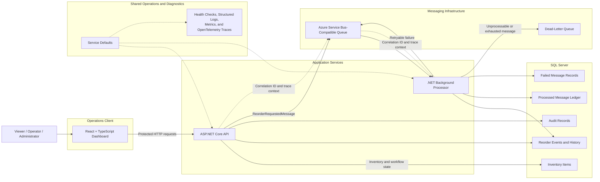

# System Architecture

## Overview

The Event-Driven Inventory Reorder Platform is a distributed .NET business application with separate user-interface, API, messaging, background-processing, and persistence responsibilities.

The architecture uses asynchronous message processing for reorder work while preserving SQL-backed business state, audit history, processing records, and failure diagnostics.

## Component Responsibilities

### React Operations Dashboard

The React and TypeScript client provides read-only operational visibility into:

* inventory quantities and status
* low-stock items
* reorder processing history
* application and database health

The client calls protected API endpoints and does not duplicate backend inventory or workflow rules.

### ASP.NET Core API

The API is responsible for:

* authenticating the local demo identity
* enforcing Viewer, Operator, and Administrator policies
* validating inventory requests
* managing inventory and reorder state
* recording successful user actions in the audit trail
* creating stable reorder messages
* propagating correlation and trace context

When an item enters a low-stock state, the API saves the business state before publishing the corresponding reorder message.

### Message Queue

The Azure Service Bus-compatible queue separates the inventory request from background reorder processing.

The platform assumes at-least-once delivery. Stable message identifiers and a SQL-backed processed-message ledger make duplicate delivery harmless.

Retryable failures return to the queue until the configured delivery limit is reached. Invalid or repeatedly failing messages are moved to the dead-letter queue.

### Background Processor

The Processor:

* consumes reorder messages
* verifies that the associated reorder event exists
* rejects unsupported workflow states
* detects previously processed messages
* records successful message processing
* updates valid reorder events to `Processed`
* records failed processing attempts
* coordinates retry and dead-letter behavior

A `Processed` reorder event represents successful internal handling of the reorder request. It does not represent delivery of physical stock.

### SQL Server

SQL Server stores the application’s durable state:

* inventory items
* reorder events
* reorder status history
* audit records
* successfully processed message identifiers
* failed message details

Business state, audit state, and message-processing state remain separate so operators can distinguish inventory conditions from workflow and infrastructure outcomes.

### Observability

Shared Service Defaults configure health checks, structured logging, metrics, and OpenTelemetry instrumentation for the API and Processor.

Each API request accepts or generates an `X-Correlation-Id`. The identifier and W3C trace context are propagated through the message boundary so a reorder workflow can be followed across the API, queue, and Processor.

## Local Runtime Modes

The same application architecture supports two local development paths:

* **.NET Aspire:** orchestrates the API, Processor, React client, SQL Server, health information, logs, metrics, and traces.
* **Docker/local mode:** runs the infrastructure through Docker Compose while the API, Processor, and frontend can be started independently.

Both modes use zero-cost local infrastructure and the same application workflow.

## Intentional Boundaries

The current architecture does not claim:

* a production identity provider
* a real supplier or purchasing integration
* exactly-once message delivery
* automatic receipt of replacement stock
* paid cloud deployment
* production hosting

These boundaries keep the portfolio project practical while making its reliability and operational claims fully defensible.